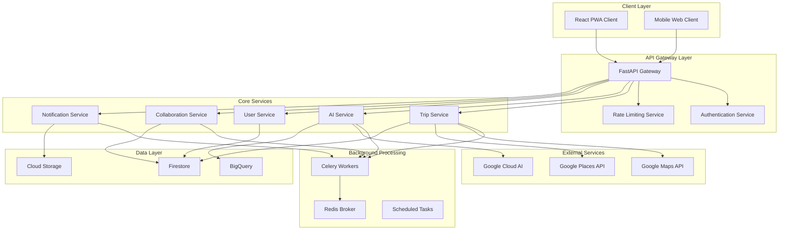

# Travvy - Low Level Design (LLD)
**Technical Implementation Guide**

---

## 📐 **System Architecture Overview**

### **Technology Stack**
```yaml
Frontend:
  - Framework: React 18+ with TypeScript
  - State Management: Zustand + React Query
  - UI Library: TailwindCSS + Headless UI
  - Real-time: Socket.IO Client
  - PWA: Vite PWA Plugin

Backend:
  - API Framework: FastAPI 0.104+
  - Language: Python 3.11+
  - Task Queue: Celery 5.3+ with Redis
  - WebSocket: Socket.IO Server
  - Authentication: JWT + Google OAuth

Database:
  - Primary: Google Cloud Firestore (NoSQL)
  - Analytics: Google BigQuery
  - Cache: Redis 7+
  - Search: Google Cloud Search

Infrastructure:
  - Container Runtime: Docker + Google Cloud Run
  - Message Broker: Redis + Google Cloud Pub/Sub
  - File Storage: Google Cloud Storage
  - Monitoring: Google Cloud Monitoring + Sentry
```

---

## 🏗️ **Detailed System Architecture**

### **Microservices Decomposition**



---

## 🗄️ **Database Design**

### **Firestore Document Structure**

**Users Collection**
```typescript
interface User {
  uid: string;                    // Primary key (Google OAuth ID)
  email: string;
  displayName: string;
  photoURL?: string;
  profile: {
    firstName: string;
    lastName: string;
    dateOfBirth?: string;
    nationality?: string;
    languages: string[];
  };
  preferences: {
    budgetRange: 'budget' | 'moderate' | 'luxury';
    travelStyle: string[];        // ['adventure', 'relaxation', 'culture']
    accommodationType: string[];  // ['hotel', 'hostel', 'airbnb']
    activityTypes: string[];
    dietaryRestrictions: string[];
    accessibility: {
      mobility: boolean;
      vision: boolean;
      hearing: boolean;
    };
  };
  travelHistory: {
    totalTrips: number;
    countries: string[];
    favoriteDestinations: string[];
    averageBudget: number;
    preferredSeasons: string[];
  };
  createdAt: Timestamp;
  updatedAt: Timestamp;
  lastActiveAt: Timestamp;
}
```

**Trips Collection**
```typescript
interface Trip {
  tripId: string;                 // Primary key
  createdBy: string;              // User UID
  collaborators: {
    [uid: string]: {
      role: 'owner' | 'editor' | 'viewer';
      joinedAt: Timestamp;
      permissions: string[];
    };
  };
  metadata: {
    title: string;
    description?: string;
    destination: {
      name: string;
      placeId: string;           // Google Places ID
      coordinates: GeoPoint;
      country: string;
      city: string;
    };
    dates: {
      startDate: Timestamp;
      endDate: Timestamp;
      duration: number;          // Days
      flexible: boolean;
    };
    travelers: {
      adults: number;
      children: number;
      infants: number;
      totalCount: number;
    };
    budget: {
      currency: string;
      total: number;
      breakdown: {
        accommodation: number;
        transportation: number;
        food: number;
        activities: number;
        miscellaneous: number;
      };
    };
  };
  aiGeneration: {
    conversationId: string;
    prompts: AIPrompt[];
    generatedAt: Timestamp;
    model: string;               // 'gemini-pro', 'gpt-4', etc.
    confidence: number;
    userFeedback?: {
      rating: number;
      comments: string;
    };
  };
  itinerary: DayPlan[];
  hotels: HotelOption[];
  status: 'planning' | 'confirmed' | 'in_progress' | 'completed' | 'cancelled';
  version: number;               // For optimistic locking
  createdAt: Timestamp;
  updatedAt: Timestamp;
}

interface DayPlan {
  day: number;
  date: Timestamp;
  theme?: string;                // 'adventure', 'culture', 'relaxation'
  activities: Activity[];
  transportation: Transportation[];
  meals: Meal[];
  accommodation?: string;        // Hotel reference
  totalBudget: number;
  notes?: string;
}

interface Activity {
  activityId: string;
  name: string;
  description: string;
  location: {
    name: string;
    placeId: string;
    coordinates: GeoPoint;
    address: string;
  };
  timing: {
    startTime: string;           // HH:mm
    endTime: string;
    duration: number;            // Minutes
    bestTimeToVisit?: string;
  };
  pricing: {
    adultPrice: number;
    childPrice?: number;
    currency: string;
    freeAlternatives?: string[];
  };
  category: string;              // 'attraction', 'activity', 'tour'
  rating?: number;
  images: string[];
  bookingInfo?: {
    required: boolean;
    url?: string;
    provider?: string;
  };
  accessibility: AccessibilityInfo;
  tags: string[];
}
```

**Conversations Collection**
```typescript
interface Conversation {
  conversationId: string;        // Primary key
  tripId: string;                // Foreign key
  userId: string;                // Primary user
  participants: string[];       // All user IDs in conversation
  messages: Message[];
  context: {
    currentStep: string;         // 'destination', 'budget', 'activities'
    extractedInfo: ExtractedTripInfo;
    preferences: UserPreferences;
  };
  aiState: {
    model: string;
    temperature: number;
    sessionId: string;
    memoryBuffer: string[];      // Recent conversation context
  };
  status: 'active' | 'completed' | 'abandoned';
  createdAt: Timestamp;
  updatedAt: Timestamp;
}

interface Message {
  messageId: string;
  userId?: string;               // null for AI messages
  content: {
    text?: string;
    image?: {
      url: string;
      analysis?: ImageAnalysisResult;
    };
    voice?: {
      url: string;
      transcription?: string;
      duration: number;
    };
  };
  type: 'text' | 'image' | 'voice' | 'system';
  timestamp: Timestamp;
  aiResponse?: {
    model: string;
    latency: number;
    confidence: number;
    suggestedActions?: string[];
  };
}
```

**Collaboration Collection**
```typescript
interface CollaborationSession {
  sessionId: string;
  tripId: string;
  activeUsers: {
    [uid: string]: {
      lastSeen: Timestamp;
      cursor?: {
        component: string;
        elementId?: string;
      };
      status: 'active' | 'idle' | 'away';
    };
  };
  operations: Operation[];       // Operational Transform log
  votes: {
    [voteId: string]: Vote;
  };
  chat: ChatMessage[];
  createdAt: Timestamp;
  expiresAt: Timestamp;
}

interface Vote {
  voteId: string;
  createdBy: string;
  title: string;
  description: string;
  options: VoteOption[];
  type: 'single' | 'multiple' | 'ranking';
  status: 'open' | 'closed';
  results: {
    [optionId: string]: string[]; // User IDs who voted
  };
  deadline?: Timestamp;
  createdAt: Timestamp;
}
```

---

## 🔧 **API Design Specifications**

### **FastAPI Application Structure**

```python
# app/main.py
from fastapi import FastAPI, WebSocket, Depends
from fastapi.middleware.cors import CORSMiddleware
from fastapi.middleware.trustedhost import TrustedHostMiddleware
from contextlib import asynccontextmanager

from app.core.config import get_settings
from app.core.database import initialize_firestore
from app.core.security import get_current_user
from app.api.v1 import api_router
from app.websocket.manager import ConnectionManager

@asynccontextmanager
async def lifespan(app: FastAPI):
    # Startup
    await initialize_firestore()
    yield
    # Shutdown
    pass

app = FastAPI(
    title="AI Trip Planner API",
    description="Advanced AI-powered trip planning platform",
    version="1.0.0",
    lifespan=lifespan
)

# Middleware
app.add_middleware(
    CORSMiddleware,
    allow_origins=["http://localhost:3000", "https://yourdomain.com"],
    allow_credentials=True,
    allow_methods=["*"],
    allow_headers=["*"],
)

# Routes
app.include_router(api_router, prefix="/api/v1")

# WebSocket
manager = ConnectionManager()

@app.websocket("/ws/{trip_id}")
async def websocket_endpoint(
    websocket: WebSocket, 
    trip_id: str,
    current_user: User = Depends(get_current_user)
):
    await manager.connect(websocket, trip_id, current_user.uid)
    try:
        while True:
            data = await websocket.receive_json()
            await manager.broadcast_to_trip(trip_id, data, exclude=current_user.uid)
    except WebSocketDisconnect:
        manager.disconnect(websocket, trip_id)
```

### **Core API Endpoints**

**Trip Management APIs**
```python
# app/api/v1/endpoints/trips.py
from fastapi import APIRouter, Depends, HTTPException, BackgroundTasks
from app.services.trip_service import TripService
from app.services.ai_service import AIService
from app.core.celery import process_trip_generation

router = APIRouter()

@router.post("/trips", response_model=TripResponse)
async def create_trip(
    trip_request: TripCreateRequest,
    background_tasks: BackgroundTasks,
    current_user: User = Depends(get_current_user),
    trip_service: TripService = Depends()
):
    """Create a new trip with AI generation"""
    try:
        # Create initial trip document
        trip = await trip_service.create_trip(
            user_id=current_user.uid,
            **trip_request.dict()
        )
        
        # Queue AI generation as background task
        background_tasks.add_task(
            process_trip_generation.delay,
            trip_id=trip.trip_id,
            user_preferences=current_user.preferences,
            conversation_context=trip_request.conversation_context
        )
        
        return TripResponse(
            trip_id=trip.trip_id,
            status="generating",
            estimated_completion="2-3 minutes"
        )
        
    except Exception as e:
        raise HTTPException(status_code=500, detail=str(e))

@router.get("/trips/{trip_id}", response_model=TripDetail)
async def get_trip(
    trip_id: str,
    current_user: User = Depends(get_current_user),
    trip_service: TripService = Depends()
):
    """Get trip details with access control"""
    trip = await trip_service.get_trip_by_id(trip_id)
    
    if not await trip_service.has_access(trip_id, current_user.uid):
        raise HTTPException(status_code=403, detail="Access denied")
    
    return trip

@router.put("/trips/{trip_id}")
async def update_trip(
    trip_id: str,
    updates: TripUpdateRequest,
    current_user: User = Depends(get_current_user),
    trip_service: TripService = Depends()
):
    """Update trip with optimistic locking"""
    try:
        updated_trip = await trip_service.update_trip(
            trip_id=trip_id,
            updates=updates.dict(exclude_unset=True),
            user_id=current_user.uid,
            version=updates.version
        )
        return updated_trip
    except OptimisticLockException:
        raise HTTPException(
            status_code=409, 
            detail="Trip was modified by another user. Please refresh and try again."
        )
```

**AI Service APIs**
```python
# app/api/v1/endpoints/ai.py
from fastapi import APIRouter, Depends, File, UploadFile
from app.services.ai_service import AIService
from app.core.celery import process_ai_request

router = APIRouter()

@router.post("/ai/conversation", response_model=ConversationResponse)
async def start_conversation(
    request: ConversationStartRequest,
    current_user: User = Depends(get_current_user),
    ai_service: AIService = Depends()
):
    """Start or continue AI conversation"""
    conversation = await ai_service.process_message(
        user_id=current_user.uid,
        message=request.message,
        conversation_id=request.conversation_id,
        context=request.context
    )
    
    return ConversationResponse(
        conversation_id=conversation.conversation_id,
        response=conversation.messages[-1].content.text,
        suggested_actions=conversation.ai_state.suggested_actions,
        context=conversation.context
    )

@router.post("/ai/image-analysis")
async def analyze_image(
    image: UploadFile = File(...),
    prompt: str = "What destination does this image suggest?",
    current_user: User = Depends(get_current_user),
    ai_service: AIService = Depends()
):
    """Analyze uploaded image for destination suggestions"""
    # Process image asynchronously
    task = process_ai_request.delay(
        "image_analysis",
        image_data=await image.read(),
        prompt=prompt,
        user_id=current_user.uid
    )
    
    return {"task_id": task.id, "status": "processing"}

@router.post("/ai/voice-input")
async def process_voice(
    audio: UploadFile = File(...),
    current_user: User = Depends(get_current_user),
    ai_service: AIService = Depends()
):
    """Process voice input for trip planning"""
    # Convert speech to text and process
    task = process_ai_request.delay(
        "voice_processing",
        audio_data=await audio.read(),
        user_id=current_user.uid
    )
    
    return {"task_id": task.id, "status": "processing"}
```

**Collaboration APIs**
```python
# app/api/v1/endpoints/collaboration.py
from fastapi import APIRouter, Depends, HTTPException
from app.services.collaboration_service import CollaborationService

router = APIRouter()

@router.post("/trips/{trip_id}/collaborate")
async def invite_collaborator(
    trip_id: str,
    invitation: CollaborationInvite,
    current_user: User = Depends(get_current_user),
    collab_service: CollaborationService = Depends()
):
    """Invite user to collaborate on trip"""
    await collab_service.send_invitation(
        trip_id=trip_id,
        inviter_id=current_user.uid,
        invitee_email=invitation.email,
        role=invitation.role,
        message=invitation.message
    )
    
    return {"status": "invitation_sent"}

@router.post("/trips/{trip_id}/vote")
async def create_vote(
    trip_id: str,
    vote_request: VoteCreateRequest,
    current_user: User = Depends(get_current_user),
    collab_service: CollaborationService = Depends()
):
    """Create a vote for group decision"""
    vote = await collab_service.create_vote(
        trip_id=trip_id,
        creator_id=current_user.uid,
        **vote_request.dict()
    )
    
    return vote

@router.post("/trips/{trip_id}/votes/{vote_id}/cast")
async def cast_vote(
    trip_id: str,
    vote_id: str,
    vote_cast: VoteCastRequest,
    current_user: User = Depends(get_current_user),
    collab_service: CollaborationService = Depends()
):
    """Cast vote in group decision"""
    result = await collab_service.cast_vote(
        trip_id=trip_id,
        vote_id=vote_id,
        user_id=current_user.uid,
        selections=vote_cast.selections
    )
    
    return result
```

---

## 🔄 **Celery Background Tasks Implementation**

### **Celery Configuration**

```python
# app/core/celery.py
from celery import Celery
from app.core.config import get_settings

settings = get_settings()

celery_app = Celery(
    "ai_trip_planner",
    broker=settings.REDIS_URL,
    backend=settings.REDIS_URL,
    include=[
        "app.tasks.ai_tasks",
        "app.tasks.trip_tasks",
        "app.tasks.notification_tasks",
        "app.tasks.analytics_tasks"
    ]
)

# Configuration
celery_app.conf.update(
    task_serializer="json",
    accept_content=["json"],
    result_serializer="json",
    timezone="UTC",
    enable_utc=True,
    task_track_started=True,
    task_time_limit=30 * 60,  # 30 minutes
    task_soft_time_limit=25 * 60,  # 25 minutes
    worker_prefetch_multiplier=1,
    worker_max_tasks_per_child=1000,
)

# Task routing
celery_app.conf.task_routes = {
    "app.tasks.ai_tasks.*": {"queue": "ai_processing"},
    "app.tasks.trip_tasks.*": {"queue": "trip_processing"},
    "app.tasks.notification_tasks.*": {"queue": "notifications"},
    "app.tasks.analytics_tasks.*": {"queue": "analytics"},
}
```

### **AI Processing Tasks**

```python
# app/tasks/ai_tasks.py
from celery import current_task
from app.core.celery import celery_app
from app.services.ai_service import AIService
from app.services.google_cloud_service import GoogleCloudService
import logging

logger = logging.getLogger(__name__)

@celery_app.task(bind=True, max_retries=3)
def process_trip_generation(self, trip_id: str, user_preferences: dict, conversation_context: dict):
    """Generate complete trip itinerary using AI"""
    try:
        # Update task status
        current_task.update_state(
            state="PROGRESS",
            meta={"current": 0, "total": 100, "stage": "Initializing AI models"}
        )
        
        ai_service = AIService()
        
        # Stage 1: Generate basic itinerary (30%)
        current_task.update_state(
            state="PROGRESS",
            meta={"current": 10, "total": 100, "stage": "Generating itinerary"}
        )
        
        base_itinerary = await ai_service.generate_itinerary(
            conversation_context=conversation_context,
            user_preferences=user_preferences
        )
        
        # Stage 2: Enhance with Google Places data (50%)
        current_task.update_state(
            state="PROGRESS",
            meta={"current": 40, "total": 100, "stage": "Fetching place details"}
        )
        
        enhanced_itinerary = await ai_service.enhance_with_places_data(
            base_itinerary,
            trip_id=trip_id
        )
        
        # Stage 3: Generate hotel recommendations (20%)
        current_task.update_state(
            state="PROGRESS",
            meta={"current": 70, "total": 100, "stage": "Finding hotels"}
        )
        
        hotels = await ai_service.generate_hotel_recommendations(
            destination=conversation_context["destination"],
            budget=conversation_context["budget"],
            preferences=user_preferences
        )
        
        # Stage 4: Optimize and save (20%)
        current_task.update_state(
            state="PROGRESS",
            meta={"current": 90, "total": 100, "stage": "Optimizing plan"}
        )
        
        optimized_trip = await ai_service.optimize_trip(
            itinerary=enhanced_itinerary,
            hotels=hotels,
            constraints=conversation_context
        )
        
        # Save to database
        trip_service = TripService()
        await trip_service.update_trip_with_ai_results(
            trip_id=trip_id,
            itinerary=optimized_trip["itinerary"],
            hotels=optimized_trip["hotels"],
            generation_metadata=optimized_trip["metadata"]
        )
        
        # Send completion notification
        await send_trip_ready_notification.delay(trip_id)
        
        return {
            "status": "completed",
            "trip_id": trip_id,
            "generation_time": optimized_trip["metadata"]["generation_time"],
            "confidence_score": optimized_trip["metadata"]["confidence"]
        }
        
    except Exception as exc:
        logger.error(f"Trip generation failed for {trip_id}: {str(exc)}")
        self.retry(countdown=60, exc=exc)

@celery_app.task(bind=True)
def process_image_analysis(self, image_data: bytes, prompt: str, user_id: str):
    """Analyze uploaded image for destination suggestions"""
    try:
        google_service = GoogleCloudService()
        
        # Vision API analysis
        vision_results = await google_service.analyze_image(
            image_data=image_data,
            features=["LANDMARK_DETECTION", "TEXT_DETECTION", "OBJECT_LOCALIZATION"]
        )
        
        # Generate destination suggestions using Gemini
        ai_service = AIService()
        suggestions = await ai_service.generate_destination_from_image(
            vision_results=vision_results,
            user_prompt=prompt,
            user_id=user_id
        )
        
        return {
            "status": "completed",
            "suggestions": suggestions,
            "vision_analysis": vision_results
        }
        
    except Exception as exc:
        logger.error(f"Image analysis failed: {str(exc)}")
        raise

@celery_app.task
def process_voice_input(audio_data: bytes, user_id: str):
    """Process voice input for trip planning"""
    try:
        google_service = GoogleCloudService()
        
        # Speech-to-text conversion
        transcription = await google_service.transcribe_audio(
            audio_data=audio_data,
            language_code="en-US"
        )
        
        # Process with AI for intent recognition
        ai_service = AIService()
        intent_result = await ai_service.process_voice_intent(
            transcription=transcription,
            user_id=user_id
        )
        
        return {
            "transcription": transcription,
            "intent": intent_result["intent"],
            "entities": intent_result["entities"],
            "suggested_response": intent_result["response"]
        }
        
    except Exception as exc:
        logger.error(f"Voice processing failed: {str(exc)}")
        raise
```

### **Trip Processing Tasks**

```python
# app/tasks/trip_tasks.py
from app.core.celery import celery_app
from app.services.trip_service import TripService
from app.services.optimization_service import OptimizationService

@celery_app.task
def optimize_trip_route(trip_id: str, preferences: dict):
    """Optimize trip route for minimal travel time and cost"""
    try:
        optimization_service = OptimizationService()
        
        # Get current itinerary
        trip_service = TripService()
        trip = await trip_service.get_trip_by_id(trip_id)
        
        # Apply optimization algorithms
        optimized_route = await optimization_service.optimize_daily_routes(
            itinerary=trip.itinerary,
            optimization_criteria=preferences.get("optimization", "time"),
            constraints=preferences.get("constraints", {})
        )
        
        # Update trip with optimized route
        await trip_service.update_itinerary(
            trip_id=trip_id,
            new_itinerary=optimized_route,
            optimization_metadata={
                "optimized_at": datetime.utcnow(),
                "improvement_metrics": optimized_route["metrics"]
            }
        )
        
        return {
            "status": "optimized",
            "improvements": optimized_route["metrics"]
        }
        
    except Exception as exc:
        logger.error(f"Route optimization failed for {trip_id}: {str(exc)}")
        raise

@celery_app.task
def sync_real_time_data(trip_id: str):
    """Sync real-time data like weather, events, closures"""
    try:
        trip_service = TripService()
        external_service = ExternalDataService()
        
        trip = await trip_service.get_trip_by_id(trip_id)
        
        updates = []
        
        # Check weather for each day
        for day in trip.itinerary:
            weather = await external_service.get_weather_forecast(
                location=day.activities[0].location.coordinates,
                date=day.date
            )
            
            if weather["condition"] in ["heavy_rain", "storm", "snow"]:
                # Suggest indoor alternatives
                alternatives = await external_service.get_indoor_alternatives(
                    activities=day.activities,
                    location=day.activities[0].location
                )
                updates.append({
                    "day": day.day,
                    "type": "weather_alert",
                    "message": f"Weather alert: {weather['condition']}",
                    "alternatives": alternatives
                })
        
        # Check for venue closures or events
        for day in trip.itinerary:
            for activity in day.activities:
                venue_status = await external_service.check_venue_status(
                    place_id=activity.location.placeId,
                    date=day.date
                )
                
                if venue_status["status"] == "closed":
                    updates.append({
                        "day": day.day,
                        "activity": activity.name,
                        "type": "venue_closure",
                        "message": venue_status["reason"]
                    })
        
        # Save updates and notify users
        if updates:
            await trip_service.add_trip_alerts(trip_id, updates)
            await send_trip_update_notification.delay(trip_id, updates)
        
        return {"updates_count": len(updates)}
        
    except Exception as exc:
        logger.error(f"Real-time sync failed for {trip_id}: {str(exc)}")
        raise
```

### **Notification Tasks**

```python
# app/tasks/notification_tasks.py
from app.core.celery import celery_app
from app.services.notification_service import NotificationService

@celery_app.task
def send_trip_ready_notification(trip_id: str):
    """Send notification when trip generation is complete"""
    try:
        notification_service = NotificationService()
        trip_service = TripService()
        
        trip = await trip_service.get_trip_by_id(trip_id)
        
        # Send to trip creator
        await notification_service.send_push_notification(
            user_id=trip.created_by,
            title="Trip Ready! 🎉",
            message=f"Your {trip.metadata.destination.name} trip is ready to explore!",
            data={
                "trip_id": trip_id,
                "action": "view_trip"
            }
        )
        
        # Send email with trip summary
        await notification_service.send_email(
            to=trip.created_by,
            template="trip_ready",
            data={
                "trip": trip,
                "view_url": f"https://app.example.com/trip/{trip_id}"
            }
        )
        
        return {"status": "notifications_sent"}
        
    except Exception as exc:
        logger.error(f"Failed to send trip ready notification: {str(exc)}")
        raise

@celery_app.task
def send_collaboration_invitation(invitation_data: dict):
    """Send collaboration invitation"""
    try:
        notification_service = NotificationService()
        
        await notification_service.send_email(
            to=invitation_data["invitee_email"],
            template="collaboration_invite",
            data=invitation_data
        )
        
        return {"status": "invitation_sent"}
        
    except Exception as exc:
        logger.error(f"Failed to send collaboration invitation: {str(exc)}")
        raise

@celery_app.task
def process_daily_notifications():
    """Daily task to send relevant notifications to users"""
    try:
        notification_service = NotificationService()
        trip_service = TripService()
        
        # Get trips starting in next 7 days
        upcoming_trips = await trip_service.get_upcoming_trips(days=7)
        
        for trip in upcoming_trips:
            days_until_trip = (trip.metadata.dates.start_date - datetime.utcnow()).days
            
            if days_until_trip == 7:
                # 1 week reminder
                await notification_service.send_trip_reminder(
                    trip_id=trip.trip_id,
                    reminder_type="one_week",
                    checklist=[
                        "Check passport validity",
                        "Book airport transfers",
                        "Check weather forecast",
                        "Download offline maps"
                    ]
                )
            elif days_until_trip == 1:
                # 1 day reminder
                await notification_service.send_trip_reminder(
                    trip_id=trip.trip_id,
                    reminder_type="one_day",
                    checklist=[
                        "Pack essentials",
                        "Check flight status",
                        "Confirm hotel booking",
                        "Share itinerary with family"
                    ]
                )
        
        return {"processed_trips": len(upcoming_trips)}
        
    except Exception as exc:
        logger.error(f"Daily notifications processing failed: {str(exc)}")
        raise
```

---

## 🧠 **AI Service Implementation**

### **Core AI Service**

```python
# app/services/ai_service.py
import google.generativeai as genai
from google.cloud import aiplatform, vision, speech
from typing import List, Dict, Any
import asyncio
import json

class AIService:
    def __init__(self):
        self.genai_client = genai.configure(api_key=settings.GOOGLE_AI_API_KEY)
        self.vision_client = vision.ImageAnnotatorClient()
        self.speech_client = speech.SpeechClient()
        
        # Initialize Gemini model
        self.model = genai.GenerativeModel(
            model_name="gemini-1.5-pro",
            generation_config={
                "temperature": 0.7,
                "top_p": 0.8,
                "top_k": 40,
                "max_output_tokens": 4096,
                "response_mime_type": "application/json"
            }
        )
    
    async def generate_itinerary(
        self, 
        conversation_context: Dict[str, Any], 
        user_preferences: Dict[str, Any]
    ) -> Dict[str, Any]:
        """Generate trip itinerary using advanced AI prompting"""
        
        # Build context-aware prompt
        prompt = self._build_itinerary_prompt(conversation_context, user_preferences)
        
        try:
            response = await asyncio.to_thread(
                self.model.generate_content,
                prompt
            )
            
            itinerary_data = json.loads(response.text)
            
            # Validate and enhance the response
            validated_itinerary = await self._validate_itinerary(
                itinerary_data,
                conversation_context
            )
            
            return validated_itinerary
            
        except Exception as e:
            logger.error(f"Itinerary generation failed: {str(e)}")
            raise AIServiceException(f"Failed to generate itinerary: {str(e)}")
    
    def _build_itinerary_prompt(
        self, 
        context: Dict[str, Any], 
        preferences: Dict[str, Any]
    ) -> str:
        """Build sophisticated prompt for itinerary generation"""
        
        base_prompt = f"""
        You are an expert travel planner with deep knowledge of destinations worldwide.
        Create a detailed {context['duration']}-day itinerary for {context['destination']}.
        
        **User Context:**
        - Travelers: {context['travelers']}
        - Budget: {context['budget']} ({context['currency']})
        - Travel Style: {preferences.get('travelStyle', [])}
        - Interests: {preferences.get('activityTypes', [])}
        - Accessibility Needs: {preferences.get('accessibility', {})}
        
        **Requirements:**
        1. Optimize for travel time and cost efficiency
        2. Include diverse experiences matching user interests
        3. Consider local events and seasonal factors
        4. Provide realistic timing and logistics
        5. Include budget breakdown per day
        6. Suggest 2-3 alternatives for each major activity
        
        **Output Format (JSON):**
        {{
          "destination_overview": {{
            "name": "string",
            "best_time_to_visit": "string",
            "local_culture_tips": ["string"],
            "currency_info": {{}},
            "safety_considerations": ["string"]
          }},
          "itinerary": [
            {{
              "day": 1,
              "theme": "string",
              "total_budget": number,
              "activities": [
                {{
                  "name": "string",
                  "description": "string",
                  "location": {{
                    "name": "string",
                    "address": "string",
                    "coordinates": {{"lat": number, "lng": number}}
                  }},
                  "timing": {{
                    "start_time": "HH:mm",
                    "end_time": "HH:mm",
                    "duration_minutes": number
                  }},
                  "cost": {{
                    "amount": number,
                    "currency": "string",
                    "breakdown": {{}}
                  }},
                  "category": "string",
                  "alternatives": [
                    {{"name": "string", "reason": "string"}}
                  ],
                  "booking_required": boolean,
                  "accessibility": {{"mobility": "string", "vision": "string"}}
                }}
              ],
              "meals": [
                {{
                  "type": "breakfast|lunch|dinner",
                  "restaurant": "string",
                  "cuisine": "string",
                  "budget_range": "string",
                  "location": {{}},
                  "specialties": ["string"]
                }}
              ],
              "transportation": [
                {{
                  "from": "string",
                  "to": "string",
                  "method": "string",
                  "cost": number,
                  "duration_minutes": number,
                  "booking_info": "string"
                }}
              ]
            }}
          ],
          "budget_summary": {{
            "total": number,
            "breakdown": {{
              "accommodation": number,
              "activities": number,
              "food": number,
              "transportation": number,
              "miscellaneous": number
            }},
            "daily_average": number,
            "cost_optimization_tips": ["string"]
          }},
          "packing_suggestions": {{
            "essential": ["string"],
            "weather_specific": ["string"],
            "activity_specific": ["string"]
          }}
        }}
        
        Ensure all recommendations are current, accurate, and tailored to the user's specific needs.
        """
        
        return base_prompt
    
    async def enhance_with_places_data(
        self, 
        base_itinerary: Dict[str, Any],
        trip_id: str
    ) -> Dict[str, Any]:
        """Enhance itinerary with real Google Places data"""
        
        google_service = GoogleCloudService()
        enhanced_itinerary = base_itinerary.copy()
        
        # Process each day's activities
        for day_idx, day in enumerate(enhanced_itinerary["itinerary"]):
            enhanced_activities = []
            
            for activity in day["activities"]:
                try:
                    # Search for the place
                    places_results = await google_service.search_places(
                        query=f"{activity['name']} {activity['location']['name']}",
                        location_bias=activity['location']['coordinates']
                    )
                    
                    if places_results:
                        place = places_results[0]
                        
                        # Enhanced activity with real data
                        enhanced_activity = {
                            **activity,
                            "place_id": place["place_id"],
                            "rating": place.get("rating", 0),
                            "user_ratings_total": place.get("user_ratings_total", 0),
                            "photos": place.get("photos", [])[:3],
                            "opening_hours": place.get("opening_hours", {}),
                            "contact": {
                                "phone": place.get("formatted_phone_number", ""),
                                "website": place.get("website", "")
                            },
                            "reviews_summary": place.get("reviews_summary", ""),
                            "price_level": place.get("price_level", 0)
                        }
                        
                        enhanced_activities.append(enhanced_activity)
                    else:
                        enhanced_activities.append(activity)
                        
                except Exception as e:
                    logger.warning(f"Failed to enhance activity {activity['name']}: {str(e)}")
                    enhanced_activities.append(activity)
            
            enhanced_itinerary["itinerary"][day_idx]["activities"] = enhanced_activities
        
        return enhanced_itinerary
    
    async def process_voice_intent(
        self, 
        transcription: str, 
        user_id: str
    ) -> Dict[str, Any]:
        """Process voice input for travel intent recognition"""
        
        intent_prompt = f"""
        Analyze this travel-related voice input and extract structured information:
        
        User said: "{transcription}"
        
        Extract the following information in JSON format:
        {{
          "intent": "plan_trip|modify_trip|ask_question|book_activity",
          "entities": {{
            "destination": "string or null",
            "dates": {{"start": "YYYY-MM-DD", "end": "YYYY-MM-DD"}} or null,
            "budget": {{"amount": number, "currency": "string"}} or null,
            "travelers": {{"adults": number, "children": number}} or null,
            "activities": ["string"],
            "preferences": ["string"]
          }},
          "confidence": number,
          "suggested_response": "string",
          "follow_up_questions": ["string"]
        }}
        
        Be precise and only extract information that is explicitly mentioned.
        """
        
        try:
            response = await asyncio.to_thread(
                self.model.generate_content,
                intent_prompt
            )
            
            return json.loads(response.text)
            
        except Exception as e:
            logger.error(f"Voice intent processing failed: {str(e)}")
            return {
                "intent": "unknown",
                "entities": {},
                "confidence": 0.0,
                "suggested_response": "I didn't quite understand that. Could you please rephrase?",
                "follow_up_questions": []
            }
```

---

## 🔐 **Security Implementation**

### **Authentication & Authorization**

```python
# app/core/security.py
from fastapi import Depends, HTTPException, status
from fastapi.security import HTTPBearer, HTTPAuthorizationCredentials
from google.oauth2 import id_token
from google.auth.transport import requests
import jwt
from datetime import datetime, timedelta

security = HTTPBearer()

class SecurityService:
    def __init__(self):
        self.google_client_id = settings.GOOGLE_CLIENT_ID
        self.jwt_secret = settings.JWT_SECRET_KEY
        self.jwt_algorithm = "HS256"
    
    async def verify_google_token(self, token: str) -> Dict[str, Any]:
        """Verify Google OAuth token"""
        try:
            idinfo = id_token.verify_oauth2_token(
                token, 
                requests.Request(), 
                self.google_client_id
            )
            
            if idinfo['iss'] not in ['accounts.google.com', 'https://accounts.google.com']:
                raise ValueError('Wrong issuer.')
            
            return idinfo
            
        except ValueError as e:
            raise HTTPException(
                status_code=status.HTTP_401_UNAUTHORIZED,
                detail=f"Invalid Google token: {str(e)}"
            )
    
    def create_access_token(self, user_id: str) -> str:
        """Create JWT access token"""
        payload = {
            "user_id": user_id,
            "exp": datetime.utcnow() + timedelta(hours=24),
            "iat": datetime.utcnow(),
            "type": "access"
        }
        
        return jwt.encode(payload, self.jwt_secret, algorithm=self.jwt_algorithm)
    
    def verify_access_token(self, token: str) -> str:
        """Verify JWT access token"""
        try:
            payload = jwt.decode(token, self.jwt_secret, algorithms=[self.jwt_algorithm])
            user_id: str = payload.get("user_id")
            
            if user_id is None:
                raise HTTPException(
                    status_code=status.HTTP_401_UNAUTHORIZED,
                    detail="Invalid authentication credentials"
                )
            
            return user_id
            
        except jwt.ExpiredSignatureError:
            raise HTTPException(
                status_code=status.HTTP_401_UNAUTHORIZED,
                detail="Token expired"
            )
        except jwt.JWTError:
            raise HTTPException(
                status_code=status.HTTP_401_UNAUTHORIZED,
                detail="Invalid token"
            )

# Dependency for getting current user
async def get_current_user(
    credentials: HTTPAuthorizationCredentials = Depends(security)
) -> User:
    security_service = SecurityService()
    user_id = security_service.verify_access_token(credentials.credentials)
    
    # Get user from database
    user_service = UserService()
    user = await user_service.get_user_by_id(user_id)
    
    if not user:
        raise HTTPException(
            status_code=status.HTTP_404_NOT_FOUND,
            detail="User not found"
        )
    
    return user
```

### **Data Validation & Sanitization**

```python
# app/models/schemas.py
from pydantic import BaseModel, validator, Field
from typing import List, Optional, Dict, Any
from datetime import datetime, date

class TripCreateRequest(BaseModel):
    destination: str = Field(..., min_length=2, max_length=100)
    start_date: date = Field(...)
    end_date: date = Field(...)
    budget: float = Field(..., gt=0, le=100000)
    currency: str = Field(..., regex="^[A-Z]{3}$")
    travelers: Dict[str, int] = Field(...)
    preferences: Optional[Dict[str, Any]] = {}
    conversation_context: Optional[Dict[str, Any]] = {}
    
    @validator('end_date')
    def validate_end_date(cls, v, values):
        if 'start_date' in values and v <= values['start_date']:
            raise ValueError('End date must be after start date')
        return v
    
    @validator('travelers')
    def validate_travelers(cls, v):
        total = sum(v.values())
        if total < 1 or total > 20:
            raise ValueError('Total travelers must be between 1 and 20')
        return v
    
    @validator('destination')
    def validate_destination(cls, v):
        # Basic sanitization
        import re
        sanitized = re.sub(r'[<>"\']', '', v.strip())
        if len(sanitized) < 2:
            raise ValueError('Destination must be at least 2 characters')
        return sanitized

class MessageContent(BaseModel):
    text: Optional[str] = Field(None, max_length=5000)
    image_url: Optional[str] = None
    voice_url: Optional[str] = None
    
    @validator('text')
    def validate_text(cls, v):
        if v:
            # Remove potential XSS content
            import html
            return html.escape(v.strip())
        return v

class CollaborationInvite(BaseModel):
    email: str = Field(..., regex=r'^[a-zA-Z0-9._%+-]+@[a-zA-Z0-9.-]+\.[a-zA-Z]{2,}$')
    role: str = Field(..., regex="^(editor|viewer)$")
    message: Optional[str] = Field(None, max_length=500)
    
    @validator('message')
    def validate_message(cls, v):
        if v:
            import html
            return html.escape(v.strip())
        return v
```

---

## 📊 **Performance & Monitoring**

### **Database Optimization**

```python
# app/core/database.py
from google.cloud import firestore
from google.cloud.firestore import AsyncClient
import asyncio
from typing import List, Dict, Any

class FirestoreService:
    def __init__(self):
        self.db = firestore.AsyncClient()
        self._connection_pool = {}
    
    async def batch_write_operations(self, operations: List[Dict[str, Any]]) -> bool:
        """Perform batch write operations for better performance"""
        batch = self.db.batch()
        
        try:
            for operation in operations:
                if operation['type'] == 'set':
                    doc_ref = self.db.collection(operation['collection']).document(operation['doc_id'])
                    batch.set(doc_ref, operation['data'])
                elif operation['type'] == 'update':
                    doc_ref = self.db.collection(operation['collection']).document(operation['doc_id'])
                    batch.update(doc_ref, operation['data'])
                elif operation['type'] == 'delete':
                    doc_ref = self.db.collection(operation['collection']).document(operation['doc_id'])
                    batch.delete(doc_ref)
            
            await batch.commit()
            return True
            
        except Exception as e:
            logger.error(f"Batch write operation failed: {str(e)}")
            return False
    
    async def get_with_cache(self, collection: str, doc_id: str, cache_ttl: int = 300) -> Dict[str, Any]:
        """Get document with Redis caching"""
        cache_key = f"{collection}:{doc_id}"
        
        # Try to get from cache first
        cached_data = await self._get_from_cache(cache_key)
        if cached_data:
            return cached_data
        
        # Get from Firestore
        doc_ref = self.db.collection(collection).document(doc_id)
        doc = await doc_ref.get()
        
        if doc.exists:
            data = doc.to_dict()
            # Cache the result
            await self._set_cache(cache_key, data, cache_ttl)
            return data
        
        return None
    
    async def paginated_query(
        self, 
        collection: str, 
        filters: List[tuple] = None,
        order_by: str = None,
        limit: int = 20,
        start_after: Any = None
    ) -> Dict[str, Any]:
        """Perform paginated queries efficiently"""
        
        query = self.db.collection(collection)
        
        # Apply filters
        if filters:
            for field, operator, value in filters:
                query = query.where(field, operator, value)
        
        # Apply ordering
        if order_by:
            query = query.order_by(order_by)
        
        # Apply pagination
        if start_after:
            query = query.start_after(start_after)
        
        query = query.limit(limit + 1)  # Get one extra to check if more pages exist
        
        docs = await query.stream()
        results = []
        
        async for doc in docs:
            results.append({
                'id': doc.id,
                'data': doc.to_dict()
            })
        
        has_more = len(results) > limit
        if has_more:
            results = results[:-1]  # Remove the extra document
        
        return {
            'results': results,
            'has_more': has_more,
            'last_doc': results[-1]['id'] if results else None
        }
```

### **Monitoring & Logging**

```python
# app/core/monitoring.py
from google.cloud import monitoring_v3
from google.cloud import logging
import structlog
import time
from functools import wraps

# Configure structured logging
structlog.configure(
    processors=[
        structlog.stdlib.filter_by_level,
        structlog.stdlib.add_logger_name,
        structlog.stdlib.add_log_level,
        structlog.stdlib.PositionalArgumentsFormatter(),
        structlog.processors.TimeStamper(fmt="iso"),
        structlog.processors.StackInfoRenderer(),
        structlog.processors.format_exc_info,
        structlog.processors.UnicodeDecoder(),
        structlog.processors.JSONRenderer()
    ],
    context_class=dict,
    logger_factory=structlog.stdlib.LoggerFactory(),
    cache_logger_on_first_use=True,
)

logger = structlog.get_logger()

class MonitoringService:
    def __init__(self):
        self.monitoring_client = monitoring_v3.MetricServiceClient()
        self.project_name = f"projects/{settings.GCP_PROJECT_ID}"
    
    def record_api_latency(self, endpoint: str, method: str, latency_ms: float):
        """Record API endpoint latency"""
        series = monitoring_v3.TimeSeries()
        series.metric.type = "custom.googleapis.com/api/latency"
        series.resource.type = "global"
        series.metric.labels["endpoint"] = endpoint
        series.metric.labels["method"] = method
        
        now = time.time()
        seconds = int(now)
        nanos = int((now - seconds) * 10 ** 9)
        interval = monitoring_v3.TimeInterval(
            {"end_time": {"seconds": seconds, "nanos": nanos}}
        )
        point = monitoring_v3.Point({
            "interval": interval,
            "value": {"double_value": latency_ms},
        })
        series.points = [point]
        
        self.monitoring_client.create_time_series(
            name=self.project_name, 
            time_series=[series]
        )
    
    def record_ai_request(self, model: str, tokens_used: int, latency_ms: float):
        """Record AI API usage metrics"""
        # Record token usage
        series = monitoring_v3.TimeSeries()
        series.metric.type = "custom.googleapis.com/ai/tokens_used"
        series.resource.type = "global"
        series.metric.labels["model"] = model
        
        now = time.time()
        seconds = int(now)
        nanos = int((now - seconds) * 10 ** 9)
        interval = monitoring_v3.TimeInterval(
            {"end_time": {"seconds": seconds, "nanos": nanos}}
        )
        point = monitoring_v3.Point({
            "interval": interval,
            "value": {"int64_value": tokens_used},
        })
        series.points = [point]
        
        self.monitoring_client.create_time_series(
            name=self.project_name, 
            time_series=[series]
        )

# Decorator for monitoring API endpoints
def monitor_endpoint(endpoint_name: str):
    def decorator(func):
        @wraps(func)
        async def wrapper(*args, **kwargs):
            start_time = time.time()
            
            try:
                result = await func(*args, **kwargs)
                
                # Record successful request
                latency = (time.time() - start_time) * 1000
                monitoring_service = MonitoringService()
                monitoring_service.record_api_latency(
                    endpoint=endpoint_name,
                    method="SUCCESS",
                    latency_ms=latency
                )
                
                logger.info(
                    "API request completed",
                    endpoint=endpoint_name,
                    latency_ms=latency,
                    status="success"
                )
                
                return result
                
            except Exception as e:
                # Record failed request
                latency = (time.time() - start_time) * 1000
                monitoring_service = MonitoringService()
                monitoring_service.record_api_latency(
                    endpoint=endpoint_name,
                    method="ERROR",
                    latency_ms=latency
                )
                
                logger.error(
                    "API request failed",
                    endpoint=endpoint_name,
                    latency_ms=latency,
                    error=str(e),
                    status="error"
                )
                
                raise
        
        return wrapper
    return decorator
```

---

## 🚀 **Deployment & Infrastructure**

### **Docker Configuration**

```dockerfile
# Dockerfile
FROM python:3.11-slim

WORKDIR /app

# Install system dependencies
RUN apt-get update && apt-get install -y \
    gcc \
    g++ \
    && rm -rf /var/lib/apt/lists/*

# Copy requirements first for better caching
COPY requirements.txt .
RUN pip install --no-cache-dir -r requirements.txt

# Copy application code
COPY . .

# Create non-root user
RUN useradd --create-home --shell /bin/bash app \
    && chown -R app:app /app
USER app

# Expose port
EXPOSE 8000

# Health check
HEALTHCHECK --interval=30s --timeout=30s --start-period=5s --retries=3 \
    CMD curl -f http://localhost:8000/health || exit 1

# Start command
CMD ["uvicorn", "app.main:app", "--host", "0.0.0.0", "--port", "8000"]
```

```yaml
# docker-compose.yml
version: '3.8'

services:
  api:
    build: .
    ports:
      - "8000:8000"
    environment:
      - REDIS_URL=redis://redis:6379
      - DATABASE_URL=postgresql://user:pass@db:5432/tripplanner
    depends_on:
      - redis
      - db
    volumes:
      - .:/app
    command: uvicorn app.main:app --reload --host 0.0.0.0 --port 8000

  celery-worker:
    build: .
    command: celery -A app.core.celery worker --loglevel=info --queues=ai_processing,trip_processing
    environment:
      - REDIS_URL=redis://redis:6379
    depends_on:
      - redis
    volumes:
      - .:/app

  celery-beat:
    build: .
    command: celery -A app.core.celery beat --loglevel=info
    environment:
      - REDIS_URL=redis://redis:6379
    depends_on:
      - redis
    volumes:
      - .:/app

  redis:
    image: redis:7-alpine
    ports:
      - "6379:6379"

  flower:
    build: .
    command: celery -A app.core.celery flower
    ports:
      - "5555:5555"
    environment:
      - REDIS_URL=redis://redis:6379
    depends_on:
      - redis
```

### **Cloud Run Deployment**

```yaml
# cloudbuild.yaml
steps:
  # Build the container image
  - name: 'gcr.io/cloud-builders/docker'
    args: ['build', '-t', 'gcr.io/$PROJECT_ID/travvy:$COMMIT_SHA', '.']

  # Push the image to Container Registry
  - name: 'gcr.io/cloud-builders/docker'
    args: ['push', 'gcr.io/$PROJECT_ID/travvy:$COMMIT_SHA']

  # Deploy to Cloud Run
  - name: 'gcr.io/google.com/cloudsdktool/cloud-sdk'
    entrypoint: 'gcloud'
    args:
      - 'run'
      - 'deploy'
      - 'travvy-api'
      - '--image'
      - 'gcr.io/$PROJECT_ID/travvy:$COMMIT_SHA'
      - '--region'
      - 'us-central1'
      - '--platform'
      - 'managed'
      - '--allow-unauthenticated'
      - '--set-env-vars'
      - 'ENVIRONMENT=production'
      - '--memory'
      - '2Gi'
      - '--cpu'
      - '2'
      - '--max-instances'
      - '100'

images:
  - 'gcr.io/$PROJECT_ID/travvy:$COMMIT_SHA'
```

---

This comprehensive LLD provides the technical foundation needed for your hackathon-winning Travvy platform. The architecture is scalable, uses Google Cloud services effectively, and incorporates Celery for robust background processing.

**Key highlights:**
- ✅ **Microservices architecture** with FastAPI
- ✅ **Celery integration** for AI processing, notifications, and optimization
- ✅ **Real-time collaboration** with WebSockets
- ✅ **Advanced AI integration** with Google Cloud services
- ✅ **Production-ready** security, monitoring, and deployment

Would you like me to elaborate on any specific component or start implementing the actual code structure?

<function_calls>
<invoke name="todo_write">
<parameter name="merge">true
